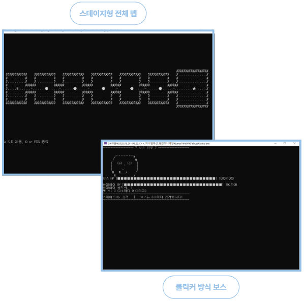

# C++을 활용한 종합 미니게임 프로그램
### Cpp_Blackjack_Maze에는 본인이 구현한 블랙잭 미니게임과 미로찾기 미니게임을 포함함.
- https://github.com/Cheon-Jaemin/Cpp_TeamProject_MiniGame (종합미니게임 팀원들과 통합)
- 시연영상 : https://youtu.be/bnlq3zsQCfQ?si=C4a77t1cU2WYYIJs

## ★ 프로젝트 소개
- C++를 활용해 여러 미니게임을 하나의 프로그램으로 통합한 종합 게임을 구현함.
- 하나의 맵에서 시작해 WASD 키로 이동하며, 방마다 다른 스테이지형 미니게임을 플레이하도록 설계함.
- 미니게임은 미로 찾기, 점프 맵, 카드 맞추기, 블랙잭, 회피 게임 등으로 구성했으며, 각 스테이지에서 보상을 획득하고 상점 시스템을 통해 장비와 무기를 강화한 뒤, 클릭커 방식의 보스 전투를 수행하도록 구현함.

## ★ 프로젝트 개요

| 구분 | 내용 |
|------|------|
| 프로젝트 규모 | 팀 프로젝트 / 4인 |
| 프로젝트 기간 | 2025.08.20 ~ 2025.08.22 |
| 담당 분야 | 블랙잭, 미로찾기 미니게임 구현 |

## ★ 사용 기술
- **개발환경** : VisualStudio
- **사용언어** : C++

## ★ 담당 역할
### 미로찾기 미니게임 구현
- 본 맵에 진입하기 전 미로찾기 게임을 C++을 활용해 콘솔창에 구현
- 미로찾기 맵은 rand()함수를 활용해 프로그램을 다시 시작할 때 마다 랜덤으로 벽/길/탈출구를 생성하도록 구현 
- time()함수와 difftime()함수를 통해 게임시작 시간과 현재 시간과 차이를 비교하여 시간 제한을 구현

### 블랙잭 미니게임 구현
- 여러 스테이지에 걸쳐 상점에 도착 시 보유한 코인을 지불하고(승리 시 2배) 플레이 할 수 있는 블랙잭 미니게임을 구현 
- 블랙잭 덱은 array 형태로 marks(♠, ♥, ◆, ♣), ranks(A ~ 10), values(2 ~ 11)를 활용해 구현
- 실제 블랙잭의 로직을 적용해 A는 초기값 11을 기준으로 점수가 21을 초과할 시 1로 자동 변경하도록 구현  
- 블랙잭 미니게임은 플레이어가 코인을 지불할 수 있는 경우 여러번 플레이할 수 있도록 구현 

## ★ 실행화면
- 이미지 클릭 시 시연영상이 재생됩니다.

